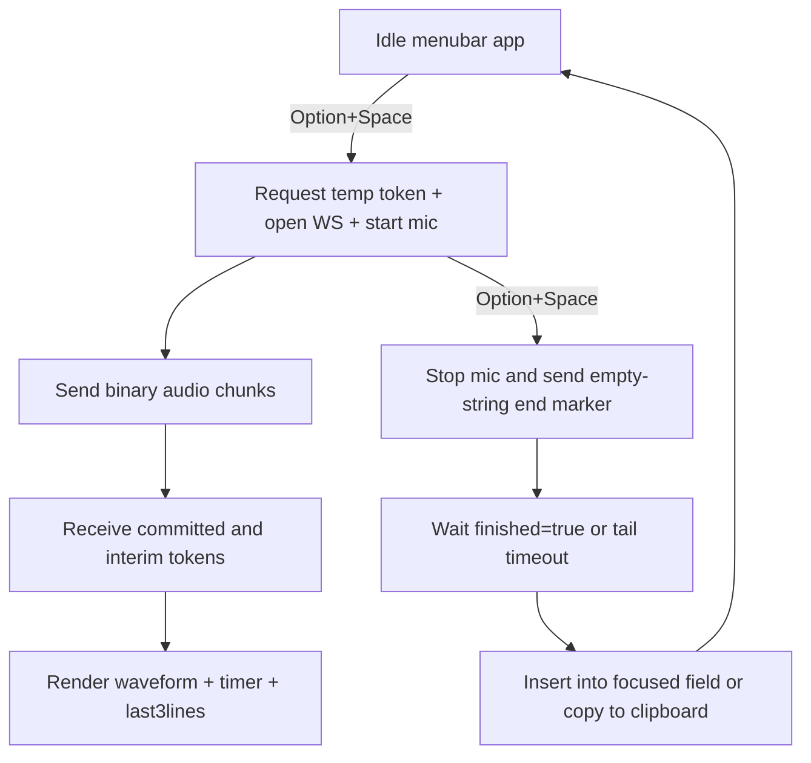

# SuperSamuel Build Plan

## Goal

Build a personal macOS app that behaves like Superwhisper, with:

- Global `Option+Space` start/stop recording
- Center overlay window with live waveform, timer, and last ~3 transcript lines
- Real-time SinusoidLabs streaming transcription (`spark` model)
- Final auto-insert into the currently focused text field (plus copy-only fallback mode)

## Current Workspace Baseline

- Existing file: `[/Users/marclamy/Documents - Local/Code/SuperSamuel/.env](/Users/marclamy/Documents%20-%20Local/Code/SuperSamuel/.env)`
- No existing app scaffolding; project starts greenfield.

## Architecture

## Implementation Phases

### 1) Scaffold two components (native app + secure broker)

- Create native app source tree under `[/Users/marclamy/Documents - Local/Code/SuperSamuel/app/](/Users/marclamy/Documents%20-%20Local/Code/SuperSamuel/app/)`.
- Create local token broker under `[/Users/marclamy/Documents - Local/Code/SuperSamuel/broker/](/Users/marclamy/Documents%20-%20Local/Code/SuperSamuel/broker/)`.
- Keep API key only in broker runtime env; app only talks to localhost broker.

### 2) Build broker (TypeScript + pnpm)

- Files:
  - `[/Users/marclamy/Documents - Local/Code/SuperSamuel/broker/package.json](/Users/marclamy/Documents%20-%20Local/Code/SuperSamuel/broker/package.json)`
  - `[/Users/marclamy/Documents - Local/Code/SuperSamuel/broker/tsconfig.json](/Users/marclamy/Documents%20-%20Local/Code/SuperSamuel/broker/tsconfig.json)`
  - `[/Users/marclamy/Documents - Local/Code/SuperSamuel/broker/src/server.ts](/Users/marclamy/Documents%20-%20Local/Code/SuperSamuel/broker/src/server.ts)`
  - `[/Users/marclamy/Documents - Local/Code/SuperSamuel/broker/.env.example](/Users/marclamy/Documents%20-%20Local/Code/SuperSamuel/broker/.env.example)`
- Expose `POST /token` that calls `https://api.sinusoidlabs.com/v1/stt/token` with `Authorization: Bearer ${API_KEY}`.
- Return only `{ token, expires_in }` to app; no key leakage in logs/errors.
- Add basic retry/backoff for `429` and clear error mapping for `401/402/404`.

### 3) Build native app shell (Swift menubar app)

- Files (core set):
  - `[/Users/marclamy/Documents - Local/Code/SuperSamuel/app/Package.swift](/Users/marclamy/Documents%20-%20Local/Code/SuperSamuel/app/Package.swift)`
  - `[/Users/marclamy/Documents - Local/Code/SuperSamuel/app/Sources/SuperSamuelApp/AppMain.swift](/Users/marclamy/Documents%20-%20Local/Code/SuperSamuel/app/Sources/SuperSamuelApp/AppMain.swift)`
  - `[/Users/marclamy/Documents - Local/Code/SuperSamuel/app/Sources/SuperSamuelApp/AppState.swift](/Users/marclamy/Documents%20-%20Local/Code/SuperSamuel/app/Sources/SuperSamuelApp/AppState.swift)`
  - `[/Users/marclamy/Documents - Local/Code/SuperSamuel/app/Sources/SuperSamuelApp/MenuBarController.swift](/Users/marclamy/Documents%20-%20Local/Code/SuperSamuel/app/Sources/SuperSamuelApp/MenuBarController.swift)`
- Implement app session state machine: `idle -> recording -> finalizing -> inserting -> done/error`.
- Add menu bar status and quick actions (`Start/Stop`, `Copy Last`, `Quit`).

### 4) Permissions + global shortcut

- Files:
  - `[/Users/marclamy/Documents - Local/Code/SuperSamuel/app/Sources/SuperSamuelApp/PermissionsService.swift](/Users/marclamy/Documents%20-%20Local/Code/SuperSamuel/app/Sources/SuperSamuelApp/PermissionsService.swift)`
  - `[/Users/marclamy/Documents - Local/Code/SuperSamuel/app/Sources/SuperSamuelApp/HotkeyService.swift](/Users/marclamy/Documents%20-%20Local/Code/SuperSamuel/app/Sources/SuperSamuelApp/HotkeyService.swift)`
- Request/check microphone and Accessibility trust.
- Register global `Option+Space` and wire to start/stop behavior.

### 5) Audio capture + waveform

- Files:
  - `[/Users/marclamy/Documents - Local/Code/SuperSamuel/app/Sources/SuperSamuelApp/AudioCaptureService.swift](/Users/marclamy/Documents%20-%20Local/Code/SuperSamuel/app/Sources/SuperSamuelApp/AudioCaptureService.swift)`
  - `[/Users/marclamy/Documents - Local/Code/SuperSamuel/app/Sources/SuperSamuelApp/WaveformModel.swift](/Users/marclamy/Documents%20-%20Local/Code/SuperSamuel/app/Sources/SuperSamuelApp/WaveformModel.swift)`
- Capture mic with `AVAudioEngine`, chunk roughly every 100ms.
- Compute RMS/peak envelope for animated waveform that reacts to voice loudness.

### 6) SinusoidLabs realtime client

- Files:
  - `[/Users/marclamy/Documents - Local/Code/SuperSamuel/app/Sources/SuperSamuelApp/STTSessionService.swift](/Users/marclamy/Documents%20-%20Local/Code/SuperSamuel/app/Sources/SuperSamuelApp/STTSessionService.swift)`
  - `[/Users/marclamy/Documents - Local/Code/SuperSamuel/app/Sources/SuperSamuelApp/TranscriptAssembler.swift](/Users/marclamy/Documents%20-%20Local/Code/SuperSamuel/app/Sources/SuperSamuelApp/TranscriptAssembler.swift)`
- Session flow:
  - Get temp token from broker
  - Connect `wss://api.sinusoidlabs.com/v1/stt/stream`
  - Send first JSON config (`token`, `model: spark`, audio format fields)
  - Stream binary audio chunks
  - Parse tokens (`is_committed` true/false) and maintain stable+interim transcript
  - On stop, send empty string to finalize and wait for tail tokens
- Handle close codes `1000/4000/4001/4002/4004` and in-stream errors.

### 7) Overlay UI matching requested UX

- Files:
  - `[/Users/marclamy/Documents - Local/Code/SuperSamuel/app/Sources/SuperSamuelApp/OverlayWindowController.swift](/Users/marclamy/Documents%20-%20Local/Code/SuperSamuel/app/Sources/SuperSamuelApp/OverlayWindowController.swift)`
  - `[/Users/marclamy/Documents - Local/Code/SuperSamuel/app/Sources/SuperSamuelApp/RecordingOverlayView.swift](/Users/marclamy/Documents%20-%20Local/Code/SuperSamuel/app/Sources/SuperSamuelApp/RecordingOverlayView.swift)`
- Centered, floating, non-intrusive window showing:
  - Recording status
  - Duration timer
  - Live waveform
  - Last ~3 transcript lines (committed + subtle interim styling)

### 8) Insert into active text field + clipboard fallback

- Files:
  - `[/Users/marclamy/Documents - Local/Code/SuperSamuel/app/Sources/SuperSamuelApp/TextInsertionService.swift](/Users/marclamy/Documents%20-%20Local/Code/SuperSamuel/app/Sources/SuperSamuelApp/TextInsertionService.swift)`
  - `[/Users/marclamy/Documents - Local/Code/SuperSamuel/app/Sources/SuperSamuelApp/ClipboardService.swift](/Users/marclamy/Documents%20-%20Local/Code/SuperSamuel/app/Sources/SuperSamuelApp/ClipboardService.swift)`
- Primary path: Accessibility insert into focused element.
- Fallback path: place transcript on clipboard + synthetic `Cmd+V`.
- Optional mode toggle: `autoPaste` vs `copyOnly`.
- Optional clipboard restore after paste.

### 9) Settings, persistence, and polish

- Files:
  - `[/Users/marclamy/Documents - Local/Code/SuperSamuel/app/Sources/SuperSamuelApp/SettingsStore.swift](/Users/marclamy/Documents%20-%20Local/Code/SuperSamuel/app/Sources/SuperSamuelApp/SettingsStore.swift)`
  - `[/Users/marclamy/Documents - Local/Code/SuperSamuel/app/Sources/SuperSamuelApp/SettingsView.swift](/Users/marclamy/Documents%20-%20Local/Code/SuperSamuel/app/Sources/SuperSamuelApp/SettingsView.swift)`
- Persist key user options (hotkey, paste/copy mode, clipboard restore, broker URL).
- Add graceful error banners/toasts for permission and connection issues.

### 10) Validation and release-ready checklist

- Add manual test checklist in `[/Users/marclamy/Documents - Local/Code/SuperSamuel/README.md](/Users/marclamy/Documents%20-%20Local/Code/SuperSamuel/README.md)`:
  - Hotkey from any app
  - Live waveform responsiveness
  - Live transcript latency
  - Stop/finalization tail handling
  - Paste into common apps (Notes, Slack, browser textareas, VS Code)
  - Clipboard restore behavior
  - Token expiry and reconnect behavior
- Document startup order for local use: broker first, app second.

## Acceptance Criteria

- `Option+Space` starts/stops reliably across apps.
- Overlay appears centered with responsive waveform and running timer.
- Transcript updates in real time and shows only recent lines.
- Final text inserts into focused text input automatically; copy fallback always works.
- API key stays out of app code and out of network requests from app to SinusoidLabs directly.

